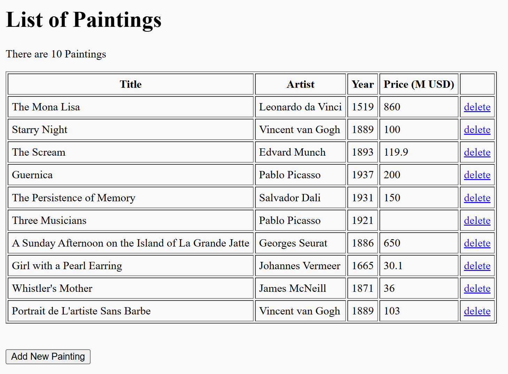

# Painting Gallery

A simple web application to display and manage a gallery of paintings. Built using PHP, SQL, HTML, and CSS.



## Features
- View all paintings in the gallery
- Add new paintings
- Delete existing paintings
- Homepage automatically redirects to gallery (`index.php`)
- Clean and responsive layout

## Technologies Used
- PHP
- MySQL / SQL
- HTML & CSS
- Git & GitHub

## Installation

1. Clone the repository:

```bash
git clone https://github.com/Shr-eyaK/painting-gallery.git
