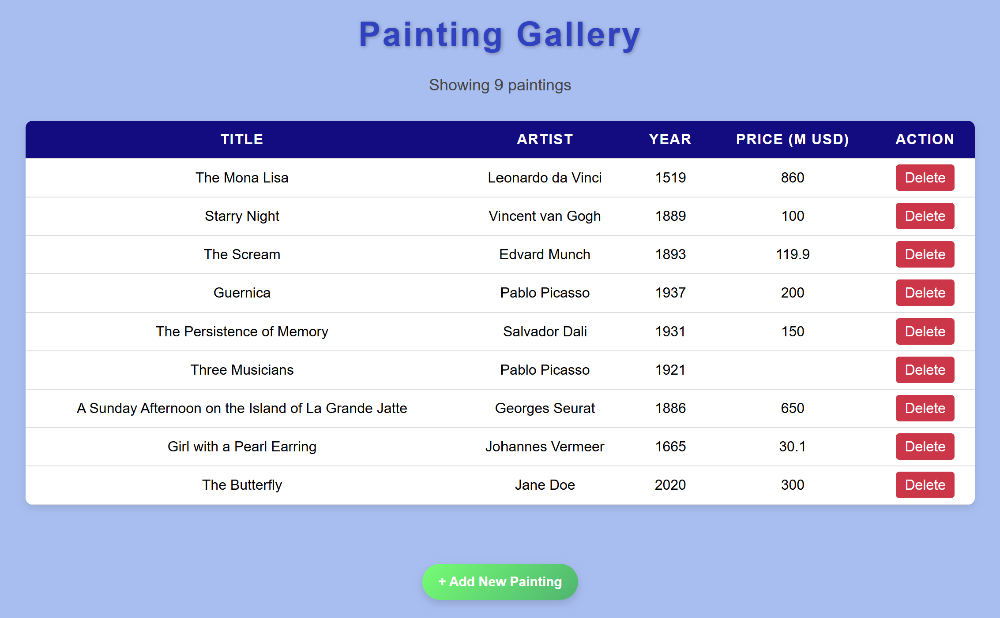

## Painting Gallery

A web application for displaying and managing a digital gallery of paintings using PHP and MySQL.

## Features

- View all paintings in a gallery layout
- Add new painting entries
- Delete existing paintings
- Database-backed storage using MySQL
- Responsive interface using HTML and CSS
- Automatic homepage redirect to gallery view

## Architecture Overview

Server-rendered PHP application with a database-backed structure.

### Frontend
- HTML and CSS for layout and styling
- Responsive gallery interface

### Backend
- PHP handles routing and CRUD operations
- MySQL stores painting information persistently

This structure separates presentation logic from database operations while maintaining a lightweight application design.

## Tech Stack

- PHP
- MySQL
- HTML
- CSS
- Git & GitHub

## Running the App

- Clone the repository
- Import the SQL database
- Configure database connection settings
- Run using XAMPP or another PHP server environment

## Roadmap

- Edit/update painting entries
- Image upload support
- Search and filtering
- Authentication system
- Improved gallery styling
